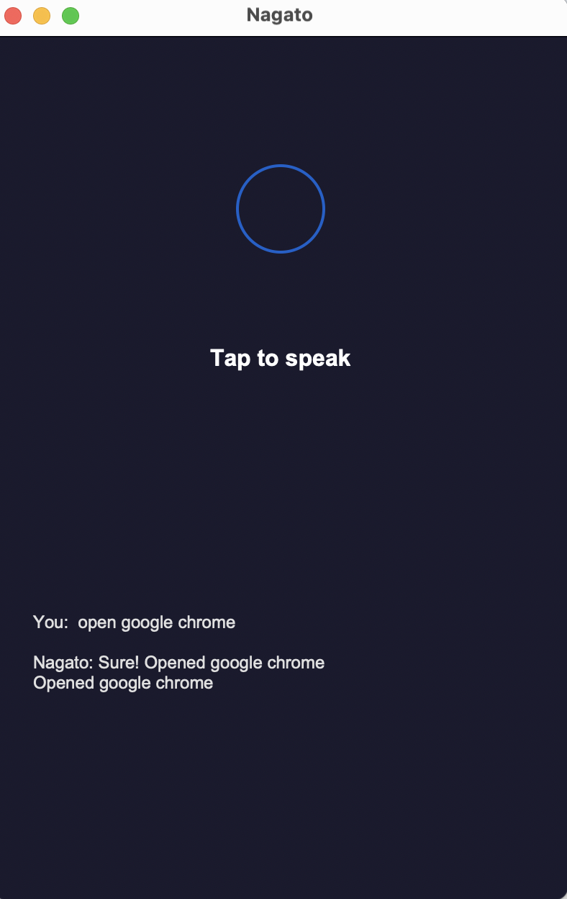
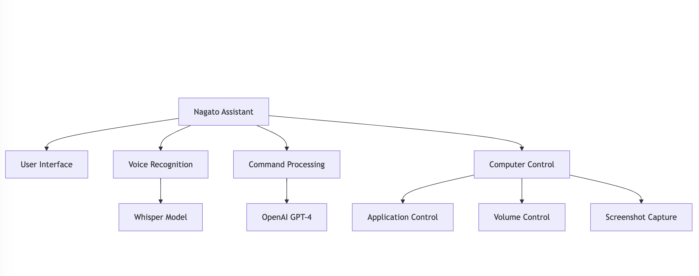

# Nagato - Voice Controlled Computer Assistant 🎙️

[](https://opensource.org/licenses/MIT)

Nagato is a sophisticated voice-controlled computer assistant that uses OpenAI's Whisper for speech recognition and GPT-4 for natural language understanding. It provides a clean, Siri-like interface for controlling your computer through voice commands.



## Features ✨

- 🎤 Real-time voice recognition using OpenAI Whisper
- 🧠 Natural language processing with GPT-4
- 💻 Computer control capabilities:
  - Application launching
  - Volume control
  - Screenshot capture
- 🎨 Modern, minimalist UI with:
  - Voice wave visualization
  - Pulsing standby indicator
  - Typing animation for responses
- 🔄 Cross-platform support (macOS, Windows, Linux)

## Architecture Diagram




## Installation 🚀

1. Clone the repository:

```bash
git clone https://github.com/allglenn/voice-controlled-computer-assistant.git
```
cd voice-controlled-computer-assistant

2. Create and activate a virtual environment:

```bash
python -m venv nagato-env
source nagato-env/bin/activate  # On Windows: nagato-env\Scripts\activate
```

3. Install dependencies:

```bash
pip install -r requirements.txt
```
4. Set up environment variables:

```bash
cp .env.example .env
# Edit .env with your OpenAI API key and preferences
```

## Usage 

1. Start Nagato:

```bash
python main.py
```

2. Click anywhere on the interface to activate voice recognition
3. Speak your command
4. Watch Nagato process and execute your request

### Example Commands 📝

- "Open Chrome browser"
- "Turn up the volume to 80"
- "Take a screenshot"
- "Make it a bit quieter"

## Configuration ⚙️

Configure Nagato through the `.env` file:


## OpenAI Configuration
OPENAI_API_KEY=your_api_key_here

## Whisper Configuration
WHISPER_MODEL=base  # Options: tiny, base, small, medium, large

## LLM Configuration
LLM_MODEL=gpt-4  # Options: gpt-4, gpt-3.5-turbo

## Audio Configuration
RECORDING_DURATION=5
SAMPLE_RATE=16000


## Requirements 📋

- Python 3.7+
- OpenAI API key
- Working microphone
- Operating system: macOS, Windows, or Linux

## Project Structure 🏗️

```bash
nagato/
├── main.py                 # Application entry point
├── nagato_ui.py           # User interface
├── services/
│   ├── vtt.py             # Voice-to-text service
│   ├── nagato_agent.py    # Command processing agent
│   ├── computer_control.py # System control functions
│   └── process_command.py  # Command processing logic
├── requirements.txt        # Project dependencies
└── .env                   # Configuration file
```

## Contributing 🤝

Contributions are welcome! Please feel free to submit a Pull Request.

1. Fork the repository
2. Create your feature branch (`git checkout -b feature/AmazingFeature`)
3. Commit your changes (`git commit -m 'Add some AmazingFeature'`)
4. Push to the branch (`git push origin feature/AmazingFeature`)
5. Open a Pull Request

## License 📄

This project is licensed under the MIT License - see the [LICENSE](LICENSE) file for details.

## Acknowledgments 🙏

- OpenAI for Whisper and GPT-4
- The open-source community


## 📧 Contact

Glenn Allogho - Tech Innovator & Software Engineer

- 🌐 [Personal Website](https://glenn.allinsoftware.io/)
- 📧 [glennfreelance365@gmail.com](mailto:glennfreelance365@gmail.com)
- 💼 [LinkedIn](https://www.linkedin.com/in/glenn-allogho-94649688/)
- 📝 [Medium](https://medium.com/@glennlenormand)
- 🐦 [Twitter](https://x.com/glenn_all)
- 💻 [GitHub](https://github.com/allglenn)

Made with ❤️ by @allglenn

---
